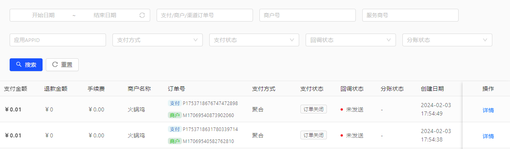
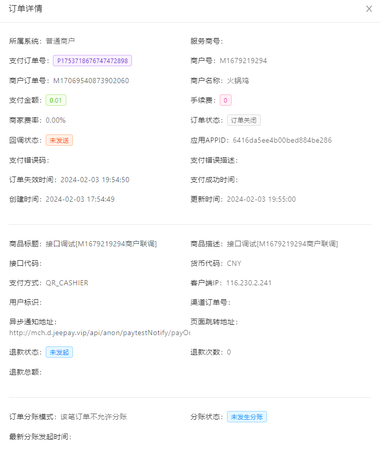
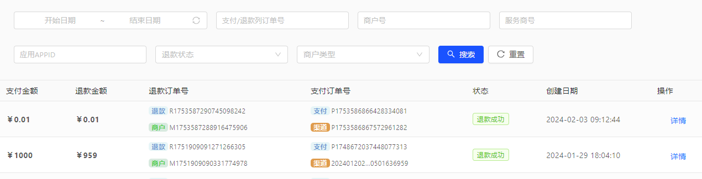
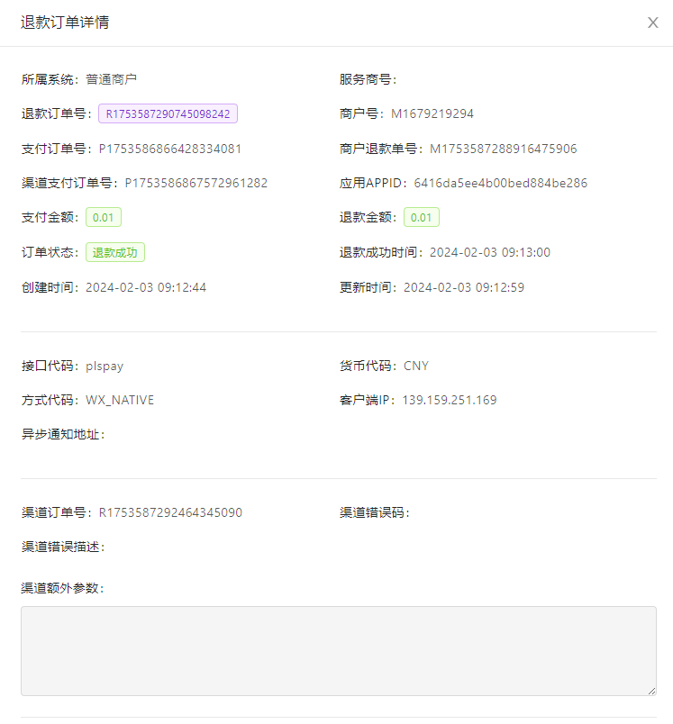

# 商户系统
## 订单管理

## 订单列表
 - 支付金额
 - 退款金额
 - 手续费
 - 订单号
 - 支付方式
 - 支付状态
 - 回调状态
 - 分账状态
 - 创建日期
 - 操作
## 支付方式
 - 微信H5
 - 微信扫码
 - 微信二维码
 - 微信公众号
 - 微信小程序
 - 支付宝H5
 - 支付宝扫码
 - 支付宝二维码
 - 支付宝公众号
 - 支付宝小程序
## 支付状态
 - 订单生成
 - 支付中
 - 支付成功
 - 支付失败
 - 已撤销
 - 已退款
 - 已关闭
## 回调状态
- 未发送
- 已发送
## 分账状态
 - 未发生分账
 - 等待分账任务处理
 - 分账处理中
 - 分账任务已结束
## 订单详情

## 退款订单

## 订单列表
 - 支付金额
 - 退款金额
 - 退款订单编号
 - 支付订单编号
 - 状态
 - 创建日期
 - 操作
## 退款状态
 - 订单生成
 - 退款中
 - 退款成功
 - 退款失败
## 退款详情

## 功能需求
### v1.0.0（2024-03-01）

# 清算系统
用于商户支付的对账和计算，协助了利益分配的完成。

## 后台菜单

## 结算流程
1. 支付网关费率
2. 业务员佣金比例
3. 平台手续费

## 数据库表
### 分账记录表
pay_order_division_record
| 字段          | 类型       | 说明               |
| ------------- | ---------- | ------------------ |
| record_id     | int(20)    | 自增ID             |
| user_id       | int(20)    | 关联用户ID         |
| source        | string(20) | 所属平台：wx/dy/tt |
| appid         | string(20) | 小程序AppId        |
| jifen         | int(20)    | 积分               |
| player_time   | int(20)    | 观看时长           |
| player_number | int(20)    | 观看短剧数量       |
| created_at    | timestamp  | 创建时间           |
| updated_at    | timestamp  | 更新时间           |

### 商户分账接收者账号组
mch_division_receiver_group

### 商户分账接收者账号绑定关系表
mch_division_receiver

### 转账订单表
transfer_order

## 功能需求
### v1.0.0（2024-03-01）
1. 设定业务员提现起始金额，默认：1000
2. 设定业务员佣金比例，默认：30%
3. 设定业务员提现周期，默认：T+7
4. 设定平台手续费，默认：0%
